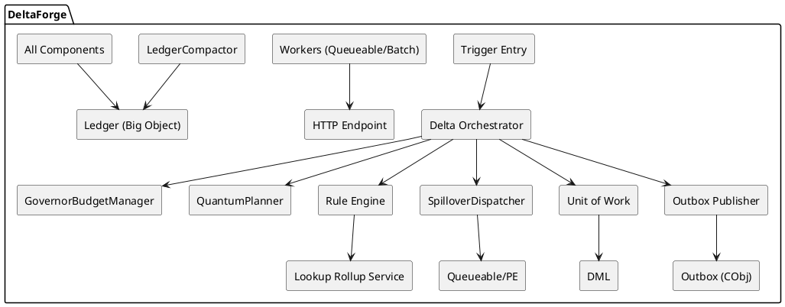

# DeltaForge Governor-Limit Design Document

## 1. Overview
This design introduces **Governor-Aware Orchestration** to DeltaForge. The system uses runtime budgets, adaptive batching, and deterministic spillover to prevent governor limit violations without losing determinism or idempotency.

## 2. Architecture Additions

### 2.1 New Components
1. **GovernorBudgetManager**
   - Tracks governor usage and budgets per subsystem.
   - Exposes “pressure” levels to orchestrator and rule engine.

2. **QuantumPlanner**
   - Slices rule DAG + record sets into quanta sized for safe execution.
   - Uses ledger cost history to predict CPU/SOQL impact.

3. **SpilloverDispatcher**
   - Defers low-priority work to async channels (Queueable / PE).
   - Ensures semantic idempotency keys are preserved.

4. **RollupCursor**
   - Tracks rollup progress for windowed rollup execution.

5. **LedgerCompactor**
   - Aggregates per-quantum ledger entries into summary records.

## 3. Updated Component Diagram (PlantUML)


## 4. Execution Flow

### 4.1 Synchronous Path
1. Trigger Entry passes SObject sets to Orchestrator.
2. Orchestrator builds Change Mask lazily.
3. BudgetManager evaluates remaining limits.
4. QuantumPlanner groups rules + records into safe quanta.
5. Rule Engine executes quanta with deterministic order.
6. SpilloverDispatcher queues remaining work if budget tight.
7. Unit of Work applies minimal DML.
8. LedgerCompactor writes summary entry.

### 4.2 Async Spillover Path
1. SpilloverDispatcher enqueues queueable/PE with idempotency key.
2. Async worker resumes execution with budgets reset.
3. RollupCursor advances for windowed rollups.

## 5. Data Structures

### 5.1 `DeltaForge__GovernorPolicy__mdt`
Stores governance thresholds and tuning parameters.

### 5.2 `DeltaForge__RollupCursor__c`
- `ParentObject`
- `CursorValue`
- `LastProcessedAt`
- `BatchSize`

### 5.3 `GovernorSnapshot` Ledger Payload
```json
{
  "cpuUsedMs": 8200,
  "cpuLimitMs": 10000,
  "soqlUsed": 63,
  "soqlLimit": 100,
  "dmlRowsUsed": 3450,
  "dmlRowsLimit": 10000,
  "heapUsedKb": 4800,
  "heapLimitKb": 6000,
  "pressure": "HIGH"
}
```

## 6. Degradation Strategy
| Threshold Breached | Action |
|---|---|
| CPU > 85% | Stop low-priority rules, spill remaining |
| SOQL > 80% | Suspend rollups, enqueue async rollup |
| DML > 80% | Batch remaining DML into async queue |
| Heap > 80% | Switch to streaming mode |

## 7. Rule Prioritization
Rules are ordered by:
1. Dependency DAG order
2. Priority (High/Medium/Low)
3. Historical cost (Ledger)

Low-priority rules are first to spill when pressure is high.

## 8. Testing Strategy
1. **Load Tests**: 10k record inserts with mixed rules.
2. **Governor Limit Tests**: Force CPU/SOQL limit boundaries.
3. **Spillover Tests**: Validate deferred execution idempotency.
4. **Rollback Safety**: Ensure partial failures do not rollback DML.

## 9. Migration Plan
1. Deploy metadata additions (GovernorPolicy, RollupCursor).
2. Activate BudgetManager in shadow mode (observe only).
3. Gradually enable spillover thresholds per object.
4. Tune policy thresholds based on Ledger telemetry.

## 10. Overlooked Considerations
1. **Scratch vs Production Limits**: Must scale policy thresholds by org type.
2. **Composite Limit Coupling**: CPU and SOQL often increase together.
3. **Event Publish Costs**: Platform Event publish also consumes CPU.
4. **Big Object Write Latency**: Ledger writes may be delayed or unordered.
5. **Named Credential Pooling**: Callouts can stall under high concurrency.
6. **Test Data Factories**: Risk of hitting limits during unit tests.
7. **Large Payload Encryption**: Outbox payload encryption can spike heap.
8. **Retry Storms**: Backoff misconfigurations can amplify load.

## 11. Open Questions
- Should spillover default to Queueable or PE?
- Should low-priority rules run in nightly batch instead?
- What SLA is acceptable for deferred rollups?
